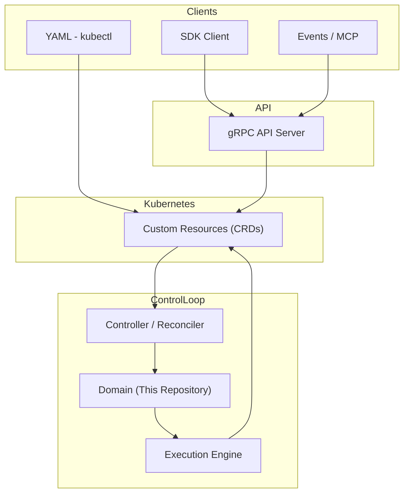

# 🌍 BlanketOps Environments

A Deterministic Software Delivery Engine for Kubernetes

BlanketOps Environments is the core resolution engine behind the BlanketOps platform.

It provides deterministic domain logic for Kubernetes-native software delivery — transforming structured Custom Resources into stable, governed execution plans.

This repository contains **pure domain and resolution logic only**.
It does not run standalone and does not include controllers or transport layers.

---

## 🧭 About BlanketOps

BlanketOps is a Kubernetes-native delivery framework designed to move code from IDE to production in minutes — with reduced entropy and governed reconciliation.

Instead of ad-hoc pipelines and implicit state, BlanketOps models delivery as structured, deterministic domain primitives:

* [Builds](https://blanketopsenvironments.netlify.app/docs/Concepts/build)
* [Deployments](https://blanketopsenvironments.netlify.app/docs/Concepts/deployment)
* [Packages](https://blanketopsenvironments.netlify.app/docs/Concepts/build)
* [Git Repositories](https://blanketopsenvironments.netlify.app/docs/Concepts/gitrepository)
* [Service Units](https://blanketopsenvironments.netlify.app/docs/Concepts/serviceunit)
* [Event Triggers](https://blanketopsenvironments.netlify.app/docs/Concepts/githubevent)

This repository implements the **resolution engine** that powers those primitives.

---

## 🧠 What This Repository Is

This module is:

* A pure Go library
* Infrastructure-agnostic
* Transport-agnostic
* Deterministic by design
* Intended to be embedded in controllers or services

It is designed to be imported by:

* Kubernetes controllers
* Delivery operators
* API backends
* CLI tools
* Platform orchestration layers

It is **not intended to be executed directly**.

---

## 🧩 How It Fits Into BlanketOps

BlanketOps Environments operates as the **resolution layer** within a larger control plane.

Different clients express intent in different ways, but all converge into a shared reconciliation model.



---

## 🔁 Core Flow Principle

All inputs — whether from SDKs, YAML, or event systems — are normalized into a single source of truth:

> **Custom Resources (CRDs)**

From there:

1. Controllers observe state changes
2. The resolver (this repository) normalizes and validates intent
3. The engine executes deterministically
4. Status is reconciled back into the resource

This ensures:

* consistent behaviour across all clients
* deterministic execution
* observable state transitions
* no hidden side effects

---

## 📚 Documentation

The full BlanketOps Environments documentation is available at:

🔗 https://blanketopsenvironments.netlify.app

### 🔹 Core References

* 📘 [CRD Definitions (Build API)](https://blanketopsenvironments.netlify.app/docs/Api/Environments/build)
* 📘 [API Overview & State Transitions](https://blanketopsenvironments.netlify.app/docs/Api/overview)
* 🧠 [Delivery Lifecycle (State Machine Model)](https://blanketopsenvironments.netlify.app/docs/Model/state-machine)

---

## 📦 Installation

```bash
go get github.com/ntlaletsi70/blanketops-environments@v0.1.9
```

---

## 🏗 Project Structure

```tree
core/           → Engine and orchestration logic.
pkg/            → Domain modules (build, deployment, packages, etc.).
resolution/     → Resolution contracts and adapters.
runtime/        → Event runtime components.
logging/        → Structured logging abstractions.
```

---

## ✨ Design Principles

BlanketOps Environments follows strict architectural boundaries:

* Deterministic resolution
* Explicit domain modeling
* Clear state transitions
* Separation of domain and infrastructure
* Reproducible outcomes
* No hidden side effects

The goal is to reduce delivery entropy through structured reconciliation.

---

## 🚧 Stability

* Current Version: **v0.1.9**
* API is evolving
* Breaking changes may occur
* Intended for alpha integration with BlanketOps controllers
* This module follows Semantic Versioning
* v1.0.0 will signal a stable public contract

---

## 🎯 Intended Consumers

This module powers:

* BlanketOps Controllers
* Delivery orchestration layers
* Reconciliation engines

If you are looking for the controller runtime, see the BlanketOps Controller repository.

---

## 🤝 Contributing

This project is currently in active development.
Contributions and architectural discussions are welcome.

---

## 📜 License

(Add your license here)
