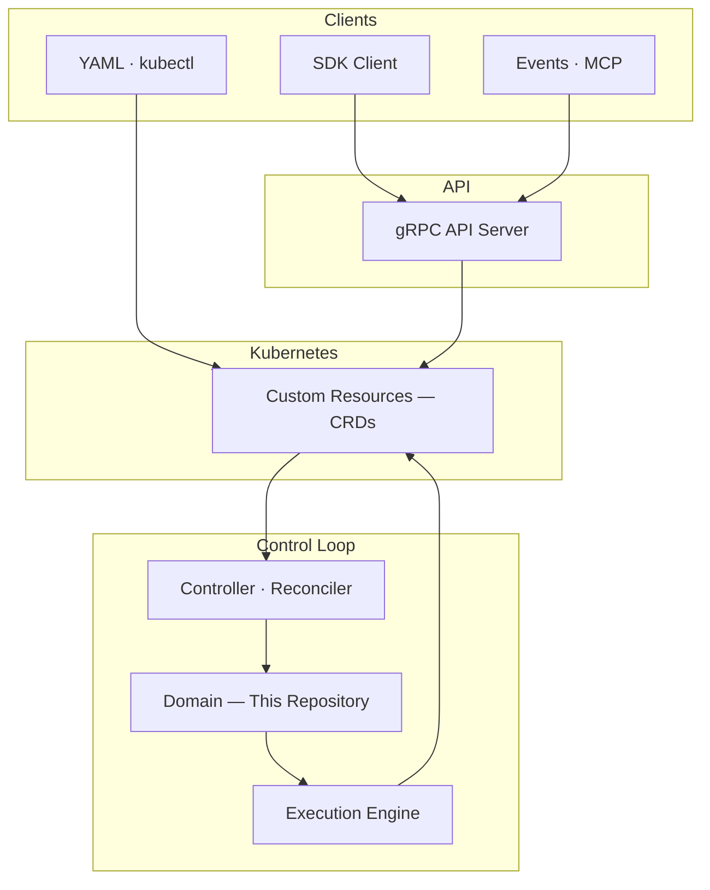
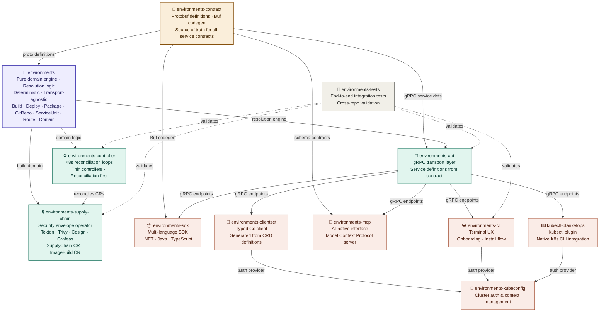

# 🌍 BlanketOps Environments

**A Deterministic Software Delivery Engine for Kubernetes.**

BlanketOps Environments is the core resolution engine behind the BlanketOps platform. It provides deterministic domain logic for Kubernetes-native software delivery — transforming structured Custom Resources into stable, governed execution plans.

---

## ❓ Why BlanketOps Environments

Modern Kubernetes delivery is fragile by default.

Teams stitch together pipelines from disconnected tools — CI systems that don't know about deployments, ingress configs that don't know about certs, workload runners that don't know about environments. The result is implicit state, hidden coupling, and entropy that compounds with every release.

**BlanketOps Environments was built to eliminate that.**

Instead of pipelines, it defines delivery as a set of composable, typed domain primitives — each owning a single concern, each reconciling toward a declared intent. Every CR in the system is a first-class citizen with a well-defined lifecycle, explicit ownership boundaries, and observable state transitions.

The result is a delivery model that is:

- **Deterministic** — the same intent always produces the same outcome.
- **Observable** — every phase transition is a typed condition, not a log line.
- **Governed** — domain boundaries are enforced structurally, not by convention.
- **Composable** — primitives chain together without tight coupling.

This is not a pipeline runner. It is a reconciliation engine. The difference matters at scale.

---

## 🧭 About BlanketOps

BlanketOps is a Kubernetes-native delivery framework designed to move code from IDE to production — with reduced entropy and governed reconciliation.

Instead of ad-hoc pipelines and implicit state, BlanketOps Environments models delivery as structured, deterministic domain primitives:

| Primitive | Responsibility | Reference |
|-----------|---------------|-----------|
| Environment | Root of the delivery chain; ClusterSecretStore authority | [docs](https://blanketopsenvironments.netlify.app/docs/Concepts/environment) |
| Build | Image build lifecycle; BuildRun orchestration | [docs](https://blanketopsenvironments.netlify.app/docs/Concepts/build) |
| Deployment | Workload rollout; ServiceUnit lifecycle | [docs](https://blanketopsenvironments.netlify.app/docs/Concepts/deployment) |
| Package | Artifact promotion and supply chain attestation | [docs](https://blanketopsenvironments.netlify.app/docs/Concepts/build) |
| GitRepository | Source binding; commit SHA resolution | [docs](https://blanketopsenvironments.netlify.app/docs/Concepts/gitrepository) |
| GitHubEvent | Webhook-driven trigger pipeline | [docs](https://blanketopsenvironments.netlify.app/docs/Concepts/githubevent) |
| ServiceUnit | Single workload declaration (image, port, size) | [docs](https://blanketopsenvironments.netlify.app/docs/Concepts/serviceunit) |
| Route | Workload-to-host binding; runtime materialisation | [docs](https://blanketopsenvironments.netlify.app/docs/Concepts/route) |
| Domain | TLS chain ownership; cert-manager + Knative bridge | [docs](https://blanketopsenvironments.netlify.app/docs/Concepts/domain) |

---

## 🧩 How It Fits Into BlanketOps Environments

BlanketOps Environments operates as the **resolution layer** within a larger control plane.

Different clients express intent in different ways, but all converge into a shared reconciliation model.



---

## 🌐 BlanketOps Environments Ecosystem

BlanketOps Environments is composed of multiple repositories, each with a clear responsibility.

This diagram shows how they relate — from the protobuf contract layer, through the core domain engine, into the platform runtime, and out to the client interfaces.



---

## 🔁 Core Flow Principle

All inputs — whether from SDKs, YAML, or event systems — are normalized into a single source of truth:

> **Custom Resources (CRDs)**

From there:

1. Controllers observe state changes.
2. The resolver (this repository) normalizes and validates intent.
3. The engine executes deterministically.
4. Status is reconciled back into the resource.

This ensures:

- Consistent behaviour across all clients.
- Deterministic execution.
- Observable state transitions.
- No hidden side effects.

---

## 🏗 Networking Layer

`v0.6.0` ships the first-class networking domain — Route and Domain — completing the delivery chain from source commit to live, TLS-terminated endpoint.

```
Deployment
  └── ServiceUnit   owns: workload declaration (image, port, size)
        ↑ serviceUnitRef
      Route         owns: host + path + runtime binding
        ↑ routeRef
      Domain        owns: TLS chain (cert-manager Certificate + Knative DomainMapping)
```

**Ownership is structural, not conventional:**

- `Route.spec.serviceUnitRef` → controller derives `ksvc name == ServiceUnit name` — no label, no status lookup.
- `Domain.spec.routeRef` → Domain is cascade-deleted when its Route is deleted.
- TLS secret name `blanketops-tls-{sanitized-host}` is the shared contract between Route (DomainMapping.Spec.TLS.SecretName) and Domain (cert-manager Certificate secretName). One convention. Two providers. Zero coupling.

**Supported runtimes:**

| Runtime | Materialises As | Status |
|---------|----------------|--------|
| `knative-service` | Knative DomainMapping via Kourier | ✅ Implemented |
| `kubernetes-container` | Kubernetes Ingress via nginx | ✅ Implemented |
| `gateway-api` | Gateway API HTTPRoute | 🔜 Planned |

**TLS strategies:**

| Strategy | Mechanism | Emits |
|----------|-----------|-------|
| `platform` | DNS01 wildcard ClusterIssuer | ClusterDomainClaim |
| `custom` | HTTP01 ACME via nginx solver | Issuer + ClusterDomainClaim + Certificate |

---

## 📚 Documentation

The full BlanketOps Environments documentation is available at:

🔗 [blanketopsenvironments.netlify.app](https://blanketopsenvironments.netlify.app)

| Reference | Link |
|-----------|------|
| 📘 CRD Definitions (Build API) | [docs](https://blanketopsenvironments.netlify.app/docs/Api/Environments/build) |
| 📘 API Overview & State Transitions | [docs](https://blanketopsenvironments.netlify.app/docs/Api/overview) |
| 🧠 Delivery Lifecycle (State Machine Model) | [docs](https://blanketopsenvironments.netlify.app/docs/Model/state-machine) |

---

## 📦 Installation

```bash
go get github.com/blanketops/blanketops-environments@v0.6.0
```

---

## 🏗 Project Structure

```
cache/              → Generation-scoped field-level cache (ObjectCache, typed helpers)
core/               → Engine, orchestration, and core.Cache factory
pkg/
  build/            → Build domain (application, api, domain layers)
  deployment/       → Deployment domain
  domain/           → Domain CR domain (TLS chain, cert-manager, Knative)
  githubevent/      → GitHubEvent trigger domain
  gitrepository/    → GitRepository source binding domain
  package/          → Package and artifact promotion domain
  route/            → Route domain (Knative DomainMapping, Kubernetes Ingress)
  serviceunit/      → ServiceUnit workload domain
resolution/
  build/            → Build resolution and contract adapter
  domain/           → Domain resolution and contract adapter
  githubevent/      → GitHubEvent resolution and contract adapter
  gitrepository/    → GitRepository resolution and contract adapter
  route/            → Route resolution and contract adapter
runtime/            → Event runtime components
logging/            → Structured logging abstractions
```

---

## ✨ Design Principles

BlanketOps Environments follows strict architectural boundaries:

- **Deterministic resolution** — the same spec always produces the same resolved struct.
- **Explicit domain modelling** — every CR owns exactly one concern. Nothing bleeds.
- **Clear state transitions** — every phase is typed; every condition is owned.
- **Separation of domain and infrastructure** — resolution is pure Go; providers are Kubernetes.
- **Convention over coordination** — `ksvc name == ServiceUnit name` eliminates cross-domain status reads.
- **Cache as fast path** — field-level generation-scoped cache eliminates redundant API server reads across the reconciliation hot path.
- **No hidden side effects** — provider dispatch is idempotent; `CreateOrUpdate` everywhere.

The goal is to reduce delivery entropy through structured reconciliation.

---

## 🚧 Stability

| | |
|---|---|
| **Current Version** | `v0.6.0` |
| **API Status** | Evolving — breaking changes possible before `v1.0.0` |
| **Intended Use** | Integration with BlanketOps Environments controllers |
| **Versioning** | Semantic Versioning — `v1.0.0` will signal a stable public contract |

---

## 🎯 Intended Consumers

This module powers:

- BlanketOps Environments Controllers.
- Delivery orchestration layers.
- Reconciliation engines.

If you are looking for the controller runtime, see the [BlanketOps Environments Controller](https://github.com/blanketops/blanketops-environments-controller) repository.

---

## 🤝 Contributing

This project is currently in active development. Contributions and architectural discussions are welcome.

---

## 📜 License

Apache License 2.0 — see [LICENSE](LICENSE) for details.