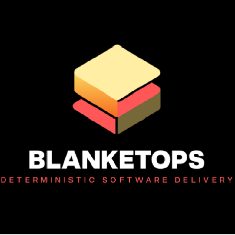

<p align="center">
  
</p>

# BlanketOps Environments

**A Deterministic Software Delivery Engine for Kubernetes.**

BlanketOps Environments is the core resolution engine behind the BlanketOps platform. It provides deterministic domain logic for Kubernetes-native software delivery — transforming structured Custom Resources into stable, governed execution plans.

---

## Why BlanketOps Environments

Modern Kubernetes delivery is fragile by default.

Teams stitch together pipelines from disconnected tools — CI systems that don't know about deployments, ingress configs that don't know about certs, workload runners that don't know about environments. The result is implicit state, hidden coupling, and entropy that compounds with every release.

**BlanketOps Environments was built to eliminate that.**

Instead of pipelines, it defines delivery as a set of composable, typed domain primitives — each owning a single concern, each reconciling toward a declared intent. Every CR in the system is a first-class citizen with a well-defined lifecycle, explicit ownership boundaries, and observable state transitions.

The result is a delivery model that is:

- **Deterministic** — the same intent always produces the same outcome.
- **Observable** — every phase transition is a typed condition, not a log line.
- **Governed** — domain boundaries are enforced structurally, not by convention.
- **Composable** — primitives chain together without tight coupling.

This is not a pipeline runner. It is a reconciliation engine. The difference matters at scale.

---

## About BlanketOps Environments

BlanketOps Environments is a Kubernetes-native delivery framework designed to move code from IDE to production — with reduced entropy and governed reconciliation.

Instead of ad-hoc pipelines and implicit state, BlanketOps Environments models delivery as structured, deterministic domain primitives:

| Primitive | Responsibility | Reference |
|-----------|---------------|-----------|
| Environment | Root of the delivery chain; ClusterSecretStore authority | [docs](https://blanketops-environments.netlify.app/docs/Concepts/environment) |
| Build | Image build lifecycle; BuildRun orchestration | [docs](https://blanketops-environments.netlify.app/docs/Concepts/build) |
| Deployment | Workload rollout; ServiceUnit lifecycle | [docs](https://blanketops-environments.netlify.app/docs/Concepts/deployment) |
| Package | Artifact promotion and supply chain attestation | [docs](https://blanketops-environments.netlify.app/docs/Concepts/build) |
| GitRepository | Source binding; commit SHA resolution | [docs](https://blanketops-environments.netlify.app/docs/Concepts/gitrepository) |
| GitHubEvent | Webhook-driven trigger pipeline | [docs](https://blanketops-environments.netlify.app/docs/Concepts/githubevent) |
| ServiceUnit | Single workload declaration (image, port, size) | [docs](https://blanketops-environments.netlify.app/docs/Concepts/serviceunit) |
| Route | Workload-to-host binding; runtime materialisation | [docs](https://blanketops-environments.netlify.app/docs/Concepts/route) |
| Domain | TLS chain ownership; cert-manager + Knative bridge | [docs](https://blanketops-environments.netlify.app/docs/Concepts/domain) |

---

## Core Flow Principle

All inputs — whether from SDKs, YAML, or event systems — are normalized into a single source of truth:

> **Custom Resources (CRDs)**

From there:

1. Controllers observe state changes.
2. The resolver (this repository) normalizes and validates intent.
3. The engine executes deterministically.
4. Status is reconciled back into the resource.

This ensures:

- Consistent behaviour across all clients.
- Deterministic execution.
- Observable state transitions.
- No hidden side effects.

---

## Since v0.6.0 → v0.7.4

- **ServiceUnit** now has its own resolution and domain floor, rather than inheriting Deployment's.
- **Deployment** strategy/reconcile dispatch split out of `api` into its own layer.
- **`core/`** split into per-concern subpackages (cache, command, conditions, engine, events, predicates, registry).
- **`pkg/secrets`** reconcilers brought up to convention and split per-reconciler, with full test coverage.
- Build teardown now deletes the underlying `Secret`, not just the `ExternalSecret`.
- CI: SLSA provenance generation for release assets, GitHub App auth (replacing an expiring PAT), advanced CodeQL scanning on every push.
- Full test coverage added across `resolution/*` and `core/*`.

---

## Documentation

The full BlanketOps Environments documentation is available at:

[blanketopsenvironments.netlify.app](https://blanketops-environments.netlify.app)

| Reference | Link |
|-----------|------|
| CRD Definitions (Build API) | [docs](https://blanketops-environments.netlify.app/docs/Api/Environments/build) |
| API Overview & State Transitions | [docs](https://blanketops-environments.netlify.app/docs/Api/overview) |
| Delivery Lifecycle (State Machine Model) | [docs](https://blanketops-environments.netlify.app/docs/Model/state-machine) |

---

## Installation

```bash
go get github.com/blanketops/environments@v0.8.2
```

---

## Project Structure

```
cache/                → Generation-scoped field-level cache (ObjectCache, typed per-CR helpers)
core/
  cache/              → core.Cache factory
  command/            → Command type handed to the engine
  conditions/         → Condition helpers (SetCondition)
  domain/             → Domain interface the engine dispatches to
  engine/             → Engine and orchestration
  events/             → EventRecorder
  predicates/         → Reconcile predicates
  registry/           → Domain registry
pkg/
  apis/
    build/            → Build domain (application, api, domain layers)
    deployment/       → Deployment domain
    domain/           → Domain CR domain (TLS chain, cert-manager, Knative)
    environment/      → Environment domain
    githubevent/      → GitHubEvent trigger domain
    gitrepository/    → GitRepository source binding domain
    packages/         → Package and artifact promotion domain
    route/            → Route domain (Knative DomainMapping, Kubernetes Ingress)
    serviceunit/      → ServiceUnit workload domain
  intent/             → Declared intent per resource
  providerconfig/     → GitHub ProviderConfig reconciler
  runtime/            → Runtime context read from the process environment
  secrets/            → Platform secrets used by resources (git, github, registry)
  serviceaccounts/    → Build and Package service account reconcilers, Package deployer binding
  utils/              → Shared helpers
resolution/
  build/              → Build resolution and contract adapter
  deployment/         → Deployment resolution and contract adapter
  domain/             → Domain resolution and contract adapter
  environment/        → Environment resolution and contract adapter
  githubevent/        → GitHubEvent resolution and contract adapter
  gitrepository/      → GitRepository resolution and contract adapter
  packages/           → Package resolution and contract adapter
  route/              → Route resolution and contract adapter
  serviceunit/        → ServiceUnit resolution and contract adapter
```

---

## Design Principles

BlanketOps Environments follows strict architectural boundaries:

- **Deterministic resolution** — the same spec always produces the same resolved struct.
- **Explicit domain modelling** — every CR owns exactly one concern. Nothing bleeds.
- **Clear state transitions** — every phase is typed; every condition is owned.
- **Separation of domain and infrastructure** — resolution is pure Go; providers are Kubernetes.
- **Convention over coordination** — `ksvc name == ServiceUnit name` eliminates cross-domain status reads.
- **Cache as fast path** — field-level generation-scoped cache eliminates redundant API server reads across the reconciliation hot path.
- **No hidden side effects** — provider dispatch is idempotent; `CreateOrUpdate` everywhere.

The goal is to reduce delivery entropy through structured reconciliation.

---

## Stability

| | |
|---|---|
| **Current Version** | `v0.8.2` |
| **API Status** | Evolving — breaking changes possible before `v1.0.0` |
| **Intended Use** | Integration with BlanketOps Environments controllers |
| **Versioning** | Semantic Versioning — `v1.0.0` will signal a stable public contract |

---

## Intended Consumers

This module powers:

- BlanketOps Environments Controllers.
- Delivery orchestration layers.
- Reconciliation engines.

If you are looking for the controller runtime, see the [BlanketOps Environments Controller](https://github.com/blanketops/environments-controller) repository.

---

## Community

BlanketOps Environments is developed in the open, and contributions are welcome.

| | |
|---|---|
| [CONTRIBUTING.md](CONTRIBUTING.md) | How to report issues, set up a development environment and open pull requests |
| [DEVELOPING.md](docs/DEVELOPING.md) | How the repositories relate, the patterns the code follows, and how to add or change a resource type |
| [CODE_OF_CONDUCT.md](.github/CODE_OF_CONDUCT.md) | The CNCF Code of Conduct, which applies in all project spaces |
| [GOVERNANCE.md](GOVERNANCE.md) | How decisions are made, the repositories in scope, and how the project relates to BlanketOps' commercial products |
| [MAINTAINERS.md](MAINTAINERS.md) | Who maintains the project |
| [ROADMAP.md](ROADMAP.md) | What has shipped and what is planned |
| [ADOPTERS.md](ADOPTERS.md) | Who uses it — add your organization |
| [SECURITY.md](.github/SECURITY.md) | Supported versions and how to report a vulnerability privately |

---

## License

Apache License 2.0 — see [LICENSE](LICENSE) for details.
