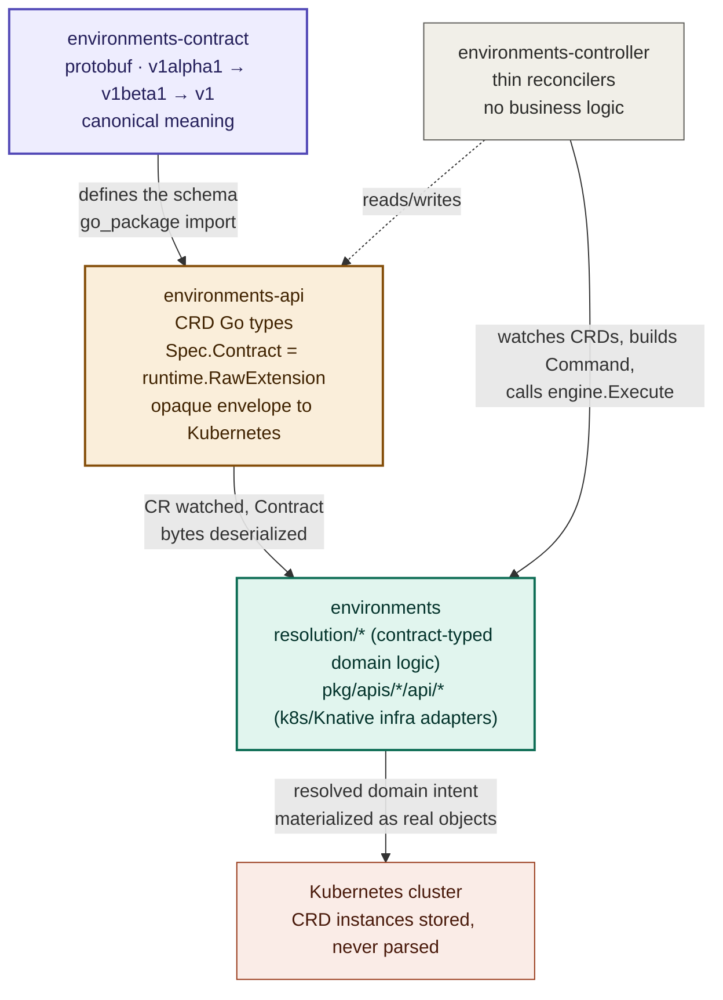
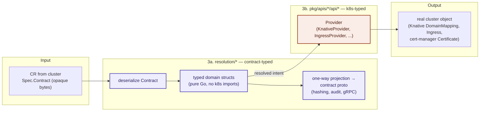
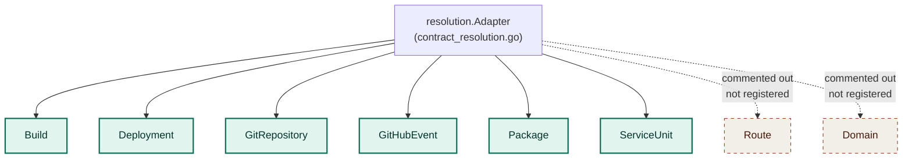

# Architecture 01: Type System & Contract Boundary

> Phase 1 of the BlanketOps architecture series. Everything below is verified
> against source as of 2026-07-20 (`environments-api v0.2.6`,
> `environments-contract v0.4.9`, pinned in `environments/go.mod`), not
> inferred from READMEs. Where a README disagrees with the code, the code
> wins and the discrepancy is called out explicitly.

## Summary

BlanketOps does not model its own resources as Kubernetes API types.
Kubernetes is one materialization target among several. The actual source
of truth for what a resource *means* — a Route, a Build, a Domain — is a
versioned protobuf contract. Everything else in the stack exists to carry
that contract somewhere and eventually act on it.

Four layers, four repos:



## Layer 1 — `environments-contract`: the canonical truth

Protobuf schemas under `blanketops/{environments,events,networks,sources}/{v1alpha1,v1beta1,v1}/*.proto`.
This defines what each resource *is*, independent of how it's transported
or stored. Example, `blanketops/networks/v1alpha1/route.proto`:

```proto
message Route {
  blanketops.common.v1.Metadata metadata = 1;
  RouteSpec spec = 2;
  RouteStatus status = 3;
}
```

Versioning is append-only once a version stabilizes (`v1alpha1` →
breaking changes allowed, `v1beta1` → feature-complete, `v1` → stable,
additive-only). `route.proto` already has `v1`, `v1beta1`, and `v1alpha1`
variants side by side — the contract evolves independently of what
Kubernetes or the engine currently support.

## Layer 2 — `environments-api`: opaque Kubernetes envelope

The CRD Go types do **not** re-declare the contract's fields. They wrap it.
From `environments-api/api/networks/v1alpha1/route.go`:

```go
// RouteSpec is a Kubernetes-native envelope around the canonical
// BlanketOps Route contract.
//
// IMPORTANT:
// - Kubernetes does NOT understand the contents of `Contract`
// - Kubernetes does NOT validate the contents of `Contract`
// - Kubernetes ONLY stores and round-trips this field
type RouteSpec struct {
    Contract runtime.RawExtension `json:"contract"`
}
```

The only genuinely "Kubernetes" field in the whole CRD is
`Status.Conditions []metav1.Condition` — kept purely so `kubectl` and
ecosystem tooling get the condition convention they expect. It carries no
BlanketOps semantics.

This is the whole point of the envelope: **the API server stores bytes it
never parses.** Schema validation, defaulting, and meaning all live in the
contract and in the engine, not in the CRD's OpenAPI schema.

## Layer 3 — `environments`: resolution, then providers

This repo has two internally distinct sub-layers that get conflated if you
just grep for k8s imports across the whole module:



### 3a. Resolution layer (`resolution/*`) — contract-typed, not k8s-typed

Takes the opaque `Contract` bytes off the CR, resolves them into typed
domain structs, and (for some domains) projects the result **one-way**
back into the contract proto for hashing/audit/gRPC responses. Per the
doc comment in `resolution/route/contract/contract_adapter.go`:

> "This projection is NEVER fed back into controllers. It is the canonical
> serialization of a resolved Route intent — output only."

`resolution/route/resolve/resolve.go` and the other domain `resolve.go`
files import neither `k8s.io/*` nor `sigs.k8s.io/controller-runtime`. The
one exception, `resolution/contract_resolution.go`, imports
`sigs.k8s.io/controller-runtime/pkg/client` only because it's the entry
point that receives the actual CR from the controller — it's the boundary,
not a leak.

### 3b. Provider / infra-adapter layer (`pkg/apis/*/api/*.go`) — necessarily k8s-typed

This is where resolved domain intent gets materialized into real cluster
objects, so it necessarily speaks native types: `k8s.io/apimachinery`,
`sigs.k8s.io/controller-runtime`, `knative.dev/serving`. Example,
`pkg/apis/route/api/knative.go`'s `KnativeProvider` builds an actual
`serving.knative.dev/v1beta1` `DomainMapping`. This is not BlanketOps
modeling its domain on Kubernetes — it's the last-mile adapter that has no
choice but to speak the target platform's API.

**Rule of thumb going forward:** if a file imports `k8s.io/*` because it's
building/reading a real cluster object (Knative, Ingress, cert-manager), that's
an infra adapter and expected. If a file imports it just for `metav1.Time`
or `metav1.Condition` as a status/timestamp convenience, that's incidental,
not architectural. Neither counts as "BlanketOps uses Kubernetes API types"
in the sense that matters for docs — the domain model itself is contract-first.

## Layer 4 — `environments-controller`: orchestration only

Thin reconcilers. Watches CRDs (the opaque envelopes), calls the engine's
mediators, writes status back. No business logic — confirmed by its own
README and consistent with the engine boundary above.

## Verified discrepancy: Route/Domain wiring status

`environments-controller`'s README states Route and Domain reconcilers are
"written, not yet registered — deferred to v0.7.0." The `environments`
README currently claims v0.6.0 "ships the first-class networking domain —
Route and Domain — completing the delivery chain." These contradict each
other, and the code confirms which one is right.

In `resolution/contract_resolution.go`, the top-level `Adapter` — the one
actually wired into the engine's entry point — has `route` and `domain`
commented out, along with the `networksv1alpha1` CRD import:

```go
type Adapter struct {
    build         *build.Adapter
    deployment    *deployment.Adapter
    gitrepository *gitRepository.Adapter
    githubevent   *gitHubEvent.Adapter
    packages      *packages.Adapter
    serviceunit   *serviceunit.Adapter
    // domain        *domain.Adapter
    // route         *route.Adapter
}
```

Route/Domain resolution and provider code exists elsewhere in the tree
(`resolution/route/*`, `resolution/domain/*`, `pkg/apis/route/*`,
`pkg/apis/domain/*`) — it's built, just not connected. **The controller
README is accurate. The `environments` README's v0.6.0 claim is not** and
needs correcting once we're back on README work.

## Currently reconciled domains

Per the live `Adapter` wiring above:


