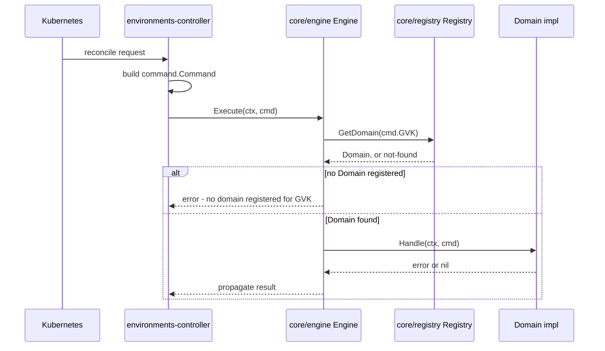
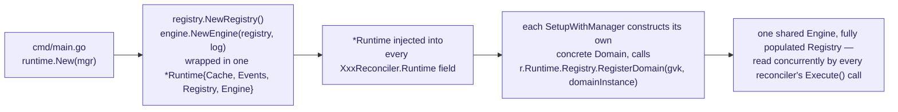
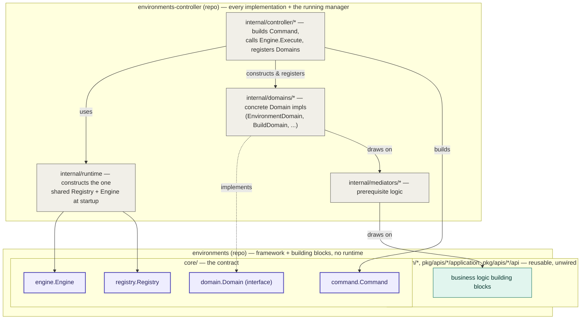
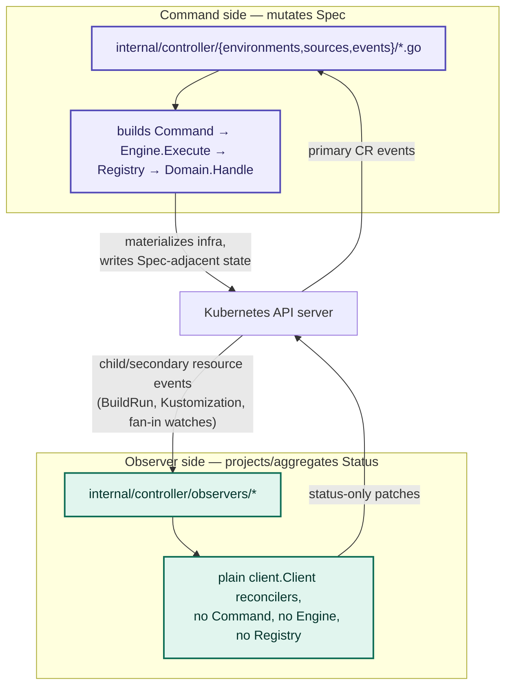

# Architecture 02: The CQRS Delegated Domain Engine

> Phase 2 of the BlanketOps architecture series. Verified against source as
> of 2026-07-20 across both `blanketops/environments` (`core/command`,
> `core/domain`, `core/registry`, `core/engine`) and
> `blanketops/environments-controller` (`internal/runtime`,
> `internal/domains/*`, `internal/mediators/*`,
> `internal/controller/observers/*`). An earlier version of this doc got the
> repo boundary wrong — corrected below, with the mistake left visible
> rather than silently fixed.

## The CQRS core

Four small packages under `core/` form the routing spine every reconcile
passes through:



**Note:** `Engine.Execute` calls `Handle` directly — it never calls
`CanCreate`/`CanUpdate`/`CanDelete`. See "Known issue" below; the package
doc's claim that the Engine "evaluates the Domain's predicates" before
dispatch does not match what the code does.

Startup-time wiring, verified against `internal/runtime/runtime.go` and each
`SetupWithManager` — happens once, before any reconcile runs:



Confirmed in `internal/runtime/runtime.go`:

```go
func New(mgr ctrl.Manager) *Runtime {
    reg := registry.NewRegistry()
    eng := engine.NewEngine(reg, ctrl.Log.WithName("environments-engine"))
    return &Runtime{Cache: objCache, Registry: reg, Engine: eng, Events: eventRecorder, Log: log}
}
```

One `Runtime` (and therefore one `Registry`, one `Engine`) is constructed at
manager startup and shared by pointer across every reconciler — the "single
Engine instance shared across all controllers" claim in `core/engine`'s
package doc is real, not aspirational.

- **`command.Command`** — `Type` (`create`/`update`/`delete`), `GVK`, `Obj`
  (always populated), `Old`/`New` (update only, so predicates can diff specs
  without a refetch). Flow is explicitly one-directional per the package
  doc: `controller-runtime event → Command → Engine → Domain → reconciliation`.
- **`domain.Domain`** — the interface every resource kind implements:
  `GVK()`, `Handle(ctx, cmd) error`, `CanCreate/CanUpdate/CanDelete(obj) bool`.
  The predicates decide whether a change is significant enough to reconcile
  at all (e.g. suppress status-only churn) before `Handle` ever runs.
- **`registry.Registry`** — `map[schema.GroupVersionKind]domain.Domain`,
  populated once at startup via `RegisterDomain`, read concurrently
  (`sync.RWMutex`) by the Engine on every reconcile. Also holds a
  `map[string]any` for pluggable build strategies (`buildpacks-v3`,
  `dockerfile`, ...), retrieved with a caller-side type assertion.
- **`engine.Engine`** — "the only component that bridges the controller
  layer and the domain layer" (package doc). `Execute()` looks the Domain
  up by `cmd.GVK` and calls `Handle` synchronously — this is the mode every
  current deployment uses. An opt-in async mode exists (`SetWorkers` +
  `StartWorkers`, a buffered channel of capacity 1024 drained by a
  goroutine pool via `Queue()`) but isn't wired into anything yet.

## Correction: where the Domain implementations actually live

An earlier version of this doc claimed concrete Domain implementations
(`BuildDomain`, `RouteDomain`, etc.) live in `environments/pkg/apis/*`, and
used that to argue the Engine has to live in `environments` too, so
registration wiring stays in one module. **That's wrong.**

`EnvironmentDomain` — a real `domain.Domain` implementation with `GVK()`,
`Handle()`, `CanCreate/CanUpdate/CanDelete()` — is defined in
`environments-controller/internal/domains/environment/environment.go`. The
same pattern holds for every other kind (`internal/domains/{build,
deployment,gitrepository,githubevent,packages,serviceunit}/`). Each one is
constructed inside its reconciler's `SetupWithManager` and registered
directly against the shared `Runtime.Registry`:

```go
// environments-controller/internal/controller/environments/environment.go
environmentDomain := environmentdomain.New(mgr.GetClient(), mgr.GetScheme(), cache, evts, log)
registry.RegisterDomain(environmentv1alpha1.GroupVersion.WithKind("Environment"), environmentDomain)
```

There's also a `Mediator` layer (`internal/mediators/*`, e.g.
`internal/mediators/gitrepository/`) sitting between the Domain and the
reusable pieces it pulls in — the `gitrepository.go` comment calls it
"Mediator (prerequisites only)". Domains construct themselves from
Mediators, application services (mappers, status writers), and API
providers — most of which *are* defined in `environments`' `pkg/apis/*`,
imported as reusable building blocks — but the top-level type that actually
satisfies `domain.Domain` and gets registered lives in
`environments-controller`, not `environments`.

## The real pattern: CQRS delegated domain engine

`environments` owns the framework and never implements it:

- `core/command.Command` — the message type.
- `core/domain.Domain` — the interface a handler must satisfy.
- `core/registry.Registry` — the lookup table.
- `core/engine.Engine` — the dispatcher.
- Plus reusable, unwired business logic any Domain can draw on:
  `resolution/*`, `pkg/apis/*/application`, `pkg/apis/*/api` providers.

None of it runs on its own — there's no `cmd/main.go`, no manager, in
`environments`. It's a library that defines a contract and hands out
building blocks.

`environments-controller` owns every implementation and never defines the
contract:

- `internal/domains/*` — the concrete `Domain` implementations.
- `internal/mediators/*` — prerequisite/orchestration logic each Domain uses.
- `internal/runtime` — constructs the one shared `Registry`+`Engine`.
- `internal/controller/*` — controller-runtime plumbing: builds `Command`s,
  calls `Engine.Execute`, registers each Domain at setup, wires finalizers
  and predicates.

This is dependency inversion, not a leak: the abstraction (`Domain`
interface, `Engine`, `Registry`) sits in the stable, framework-side repo;
concrete implementations are delegated to whichever repo actually consumes
them and register themselves in. It's the same shape as `http.Handler`
living in `net/http` while every application defines its own handlers —
the interface owner doesn't own the implementations, by design.



## The other half: Command side vs. Observer side

Everything above is the "C" — Commands mutate `Spec`, routed through one
Engine to one Domain per GVK. The "Q" is a separate, deliberately isolated
class of reconciler that never touches the Command/Engine/Domain path at
all: `environments-controller/internal/controller/observers/*`.

There are four of them, and the pattern is consistent across all:

| Observer | Watches | Writes | Never touches |
|---|---|---|---|
| `build` | `Build` (self), fans out via `GitHubEvent` watch | `Build.Annotations` (trigger metadata, retry-attempt bump) | `Build.Spec.Contract` |
| `buildrun` | Shipwright `BuildRun` (child resource) | `Build.Status` | `Build.Spec` |
| `deployment` | Flux `Kustomization` (child resource) | `Deployment.Status` — doc comment: *"MUST NOT mutate domain state beyond status writes"* | `Deployment.Spec` |
| `environment` | Build/GitRepository/Deployment/Route/Package/ServiceUnit (fan-in via `Watches` + `EnqueueRequestsFromMapFunc`) | `Environment.Status` (aggregated readiness/phase); additively patches its *own* `Spec.Contract` refs only | Specs of the CRs it aggregates from |

The `environment` observer's own package doc states the boundary outright:

> "CQRS boundary: this reconciler never touches composed CR specs."

So the full picture:



This is what makes "CQRS" a defensible label rather than borrowed
vocabulary: there are genuinely two segregated code paths, enforced by repo
convention and (for `environment`) stated outright in a doc comment, not
just two ends of the same reconciler.

**Where it connects back to the predicate bug below:** `build-observer`'s
`applyRetry` is what actually bumps `build.blanketops.dev/retry-attempt` —
so `MeaningfulChangePredicate`'s Build case (comparing only that
annotation) exists specifically to catch retry-triggered re-reconciliation
from the observer side. The design intent is coherent; the implementation
is incomplete (filter disabled in `build.go`, and no spec-diff fallback).

## Known issue: two predicate mechanisms, one of them dead, one of them disabled where it matters

There are two separate places in this codebase that answer "should this
event trigger reconciliation," and they don't agree with each other or
with their own doc comments.

**1. `domain.Domain.CanCreate/CanUpdate/CanDelete` — declared, never called.**
`core/domain/domain.go`'s package doc states: *"The Engine routes Commands
to the matching Domain, evaluates the Domain's predicates to determine
whether reconciliation should proceed, and calls Handle."* `core/engine/engine.go`'s
`Execute()` does not do this — it only does a registry lookup and calls
`Handle`. Grepping both `environments` and `environments-controller` for
`.CanCreate(`, `.CanUpdate(`, `.CanDelete(` returns zero call sites outside
the interface declaration and its implementations. Every Domain
implementation is required to write these three methods to satisfy the
interface, and none of that code path is ever reached.

**2. `core/predicates.MeaningfulChangePredicate()` — the mechanism actually
used, wired at the controller-runtime level via `WithEventFilter()` in each
reconciler's `SetupWithManager`, not through the Domain interface at all.**
It type-switches on the CR kind and suppresses Update events where nothing
but status/metadata changed, comparing `!reflect.DeepEqual(old.Spec, newObj.Spec)`
for every kind — **except `Build`**:

```go
case *environmentsv1alpha1.Build:
    newObj, ok := e.ObjectNew.(*environmentsv1alpha1.Build)
    if !ok {
        return true
    }
    return old.Annotations["build.blanketops.dev/retry-attempt"] != newObj.Annotations["build.blanketops.dev/retry-attempt"]
```

Build compares only the retry-attempt annotation — not `Spec` at all. This
is deliberate enough to have its own test
(`TestMeaningfulChangePredicate_Build_ComparesRetryAttemptAnnotation`),
which asserts exactly this: *"expected an unchanged retry-attempt
annotation to suppress reconciliation regardless of spec."* So a genuine
edit to a Build's spec, without also bumping that annotation, is silently
dropped by this predicate — never reconciled.

Consistent with that, `environments-controller/internal/controller/environments/build.go`
has its `WithEventFilter` line commented out entirely:

```go
return ctrl.NewControllerManagedBy(mgr).
    For(&environmentsv1alpha1.Build{}).
    // WithEventFilter(predicates.MeaningfulChangePredicate()).
    Named("environments-build").
    Complete(r)
```

Every other reconciler (`gitrepository.go`, `package.go`, `serviceunit.go`,
`environment.go`, `deployment.go`, `githubevent.go`) has this filter live.
Build is the only one without it — which reads as a workaround for the bug
above (the predicate wrongly drops real spec edits, so someone disabled
filtering for Build rather than fixing the predicate case) rather than an
intentional design choice. The tradeoff: Build now has **no** update
filtering at all, so a pure status-only write — exactly the case this
whole predicate package exists to suppress, per its own doc comment about
avoiding "a tight reconciliation loop" — currently passes straight through
for Build.

**Net effect:** Build's spec-change filtering is inconsistent with every
other domain in two ways that don't cancel out — a fixed predicate would
still need the annotation-vs-spec logic corrected, not just re-enabled.
Not fixed here — this doc only records what the code currently does.

## Open question

The framework-vs-implementation split (`environments` defines the contract,
`environments-controller` implements and runs it) is explained by
dependency inversion — that part is resolved. What's still open is *why the
contract-holder and the sole implementer are different repos at all*, given
`environments-controller` is the only thing that ever constructs a
`Registry` or calls `Engine.Execute`. Testability of `core/*` in isolation
without a manager is a plausible reason; so is repo history predating the
"migrating to `BlanketOps/environments`" rename noted in the controller's
README. Neither is verified — flagged for the next pass, not answered here.
