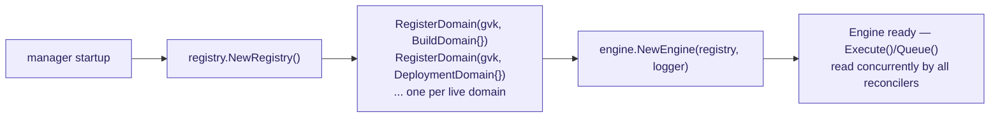
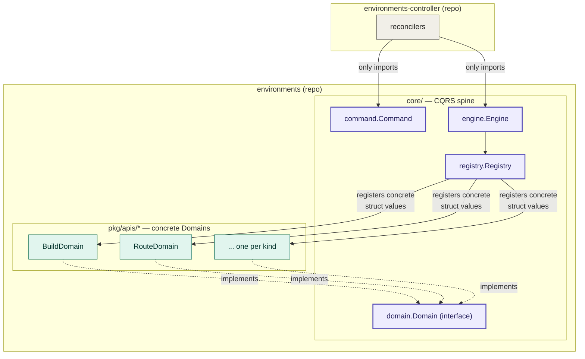

# Architecture 02: The Engine, and Why It Lives Here

> Phase 2 of the BlanketOps architecture series. Verified against source as
> of 2026-07-20 (`core/command`, `core/domain`, `core/registry`,
> `core/engine` in `blanketops/environments`).

## The CQRS core

Four small packages under `core/` form the routing spine every reconcile
passes through:

```mermaid
sequenceDiagram
    participant KR as Kubernetes<br/>(CR change)
    participant CT as environments-controller<br/>(reconciler)
    participant EN as core/engine<br/>Engine
    participant RG as core/registry<br/>Registry
    participant DM as pkg/apis/&lt;kind&gt;<br/>Domain impl

    KR->>CT: reconcile request
    CT->>CT: build command.Command{Type, GVK, Obj, Old, New}
    CT->>EN: Execute(ctx, cmd)
    EN->>RG: GetDomain(cmd.GVK)
    RG-->>EN: Domain (or not-found)
    alt no Domain registered
        EN-->>CT: error "no domain registered for GVK"
    else Domain found
        EN->>DM: Handle(ctx, cmd)
        Note over DM: CanCreate/CanUpdate/CanDelete<br/>already evaluated as predicates
        DM-->>EN: error or nil
        EN-->>CT: propagate (nil / requeue error)
    end
```

Startup-time wiring (once, before any reconcile runs):



- **`command.Command`** — `Type` (`create`/`update`/`delete`), `GVK`, `Obj`
  (always populated), `Old`/`New` (update only, so predicates can diff specs
  without a refetch). Flow is explicitly one-directional per the package
  doc: `controller-runtime event → Command → Engine → Domain → reconciliation`.
- **`domain.Domain`** — the interface every resource kind implements:
  `GVK()`, `Handle(ctx, cmd) error`, `CanCreate/CanUpdate/CanDelete(obj) bool`.
  The predicates decide whether a change is significant enough to reconcile
  at all (e.g. suppress status-only churn) before `Handle` ever runs.
- **`registry.Registry`** — `map[schema.GroupVersionKind]domain.Domain`,
  populated once at startup via `RegisterDomain`, read concurrently
  (`sync.RWMutex`) by the Engine on every reconcile. Also holds a
  `map[string]any` for pluggable build strategies (`buildpacks-v3`,
  `dockerfile`, ...), retrieved with a caller-side type assertion.
- **`engine.Engine`** — "the only component that bridges the controller
  layer and the domain layer" (package doc). `Execute()` looks the Domain
  up by `cmd.GVK` and calls `Handle` synchronously — this is the mode every
  current deployment uses. An opt-in async mode exists (`SetWorkers` +
  `StartWorkers`, a buffered channel of capacity 1024 drained by a
  goroutine pool via `Queue()`) but isn't wired into anything yet.

## Why the engine lives in `environments`, not `environments-controller`

`Registry.RegisterDomain(gvk, domainInstance)` takes a **concrete Go value**
implementing the `Domain` interface. That's the load-bearing constraint:
registration is direct struct wiring, not a cross-process or reflection-based
plugin mechanism. The `domain.Domain` package doc says implementations "live
under `pkg/<domain>/`" — and that's `pkg/apis/*` inside this same repo.

Two ways this could have been split, and why neither happened:

- **Engine in the controller repo** — would force `environments-controller`
  to import every `pkg/apis/<kind>` domain package directly just to build
  the registry at startup. That's exactly what its own README says it's
  built to avoid: *"The controller does not contain business rules. It
  orchestrates reconciliation."* A thin controller can't also be the thing
  wiring in every domain implementation.
- **Domains in their own repo(s), separate from `core/`** — would mean
  crossing a repo/module boundary purely to satisfy a Go interface, with no
  actual decoupling benefit, since `core/domain`'s interface and every
  implementation still have to compile against the same `command.Command`
  type and get registered into the same `Registry` instance in-process.

So the boundary that actually holds is: **`environments-controller` only
depends on `command.Command` and `engine.Engine`.** It translates a
controller-runtime reconcile request into a `Command` and calls
`engine.Execute(ctx, cmd)` — it never imports a domain package. Everything
that requires direct Go-level wiring — `core/*` and every `pkg/apis/*`
Domain implementation — stays in `environments`.



The arrow that matters: `environments-controller` never crosses into
`pkg/apis/*`. Everything below the `core/` line is invisible to it.

## Open question

This explains what the code enforces structurally. It doesn't cover
non-technical reasons for the split (team ownership, release cadence, the
repo's history before the "migrating to `BlanketOps/environments`" rename
noted in the controller's README). Flagged for the next pass, not answered
here.
